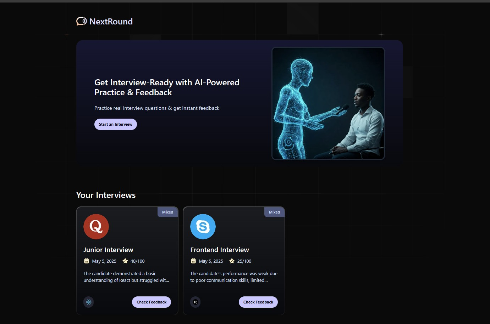
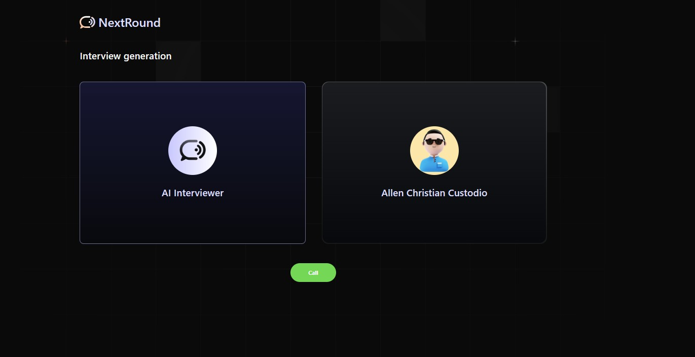
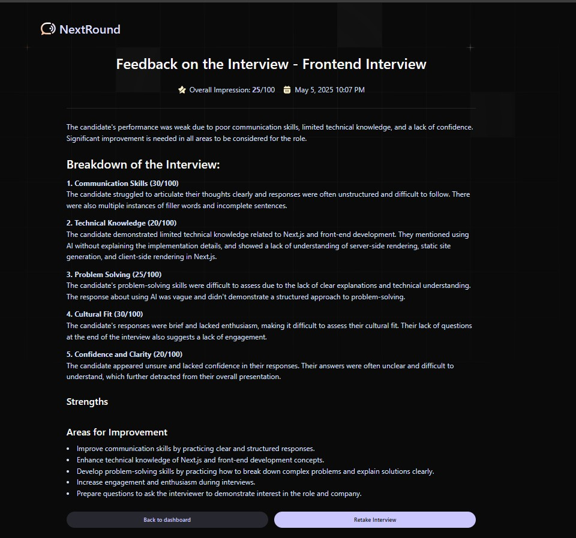

# 🤖 NEXTROUND (AI Mock Interview Platform)

[Live Demo 🚀](https://nextround.vercel.app/)

A real-time, voice-based mock interview app powered by Vapi and Gemini. Built with Next.js and Firebase, this project simulates a realistic interview environment and provides AI-generated feedback on communication, technical knowledge, and problem-solving skills.

---

## 💡 Features

- 🎤 **Voice Interaction** – Simulate interviews using Vapi’s voice SDK.
- 🧠 **AI Feedback** – Automatically generate structured evaluations with Gemini.
- 📊 **Score Breakdown** – Receive detailed scores for multiple skill categories.
- 🔄 **Transcript Review** – See full transcripts of your mock interviews.
- ☁️ **Cloud-Based** – Firebase handles secure data storage and retrieval.

---

## 🚀 Tech Stack

- **Frontend:** Next.js, TypeScript, Tailwind CSS
- **Backend:** Firebase (Firestore)
- **AI Services:** Vapi (voice SDK), Google Gemini (LLM)
- **Other:** Server Actions, AI SDK, ShadCN UI

---

## 📸 Screenshots

### 🏠 Home

### 🎙️ Interview

### 📝 Feedback

